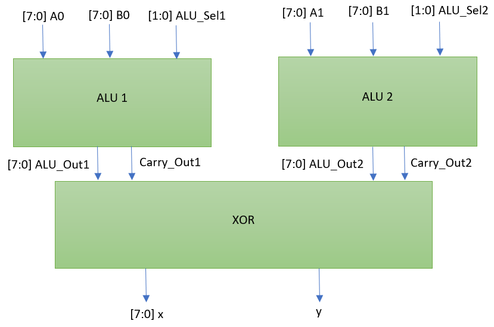

# Caravel Board Silicon Bring-up

This repo provides firmware examples, flash programming and diagnostic tools for testing
Open MPW and chipIgnite projects using Caravel.  It also provides schematics, layout and gerber files for PCB evaluation and breakout boards.

Additionally, it contains firmware developed to test the MPW-5 (ALU XOR) chip. [MPW-5 ALU_XOR](https://github.com/Janavind/My_alu_xor)

## ChipIgnite Projects (including Stanford)

See the README for testing projects here -- https://github.com/efabless/caravel_board/tree/main/firmware/chipignite#readme

## Firmware

You will need python 3.6 or later.  

To program Caravel, connect the evaluation board using a USB micro B connector.

```bash
pip3 install pyftdi

cd firmware/blink

make clean flash
```

### Install Toolchain for Compiling Code

#### For Mac

https://github.com/riscv/homebrew-riscv

#### For Linux

https://github.com/riscv/riscv-gnu-toolchain

### Diagnostics

Makefiles in the firmware project directories use 

> firmware/chipignite/util/caravel_hkflash.py 

to program the flash on the board through Caravel's housekeeping SPI interface.

> firmware/chipignite/util/caravel_hkdebug.py 

provides menu-driven debug through the housekeeping SPI interface for Caravel.

## Hardware

The current evaluation board for Caravel can be [found here](hardware/development/caravel-dev-v5-M.2)

- The clock is driven by X1 with a frequency of 10MHz. To drive the clock with custom frequency, disable X1 through J6 and use the external pin for `xclk`
- The voltage regulator U5 and U6 supply `1.8V` and `3.3V` through J8 and J9. The traces have to be cut if they are supplied externally.
- `vccd1` is connected to `1.8V` through J3. The trace has to be cut if it is supplied externally
- `vddio` is connected to `3.3V` through J5. The trace has to be cut if it is supplied externally

The most updated breakout board for Caravel can be found [here](hardware/breakout/caravel-M.2-card-QFN)

## MPW-5 ALU_XOR

The MPW-5 ALU_XOR RTL design consists of two 8-bit ALU modules whose outputs connect to an 8-bit XOR gate. The RTL
can be viewed here: [MPW-5 ALU_XOR](https://github.com/Janavind/My_alu_xor). See block diagram below.



## Flashing Firmware to Board

These instructions are based on firmware developed to test the MPW-5 ALU XOR efabless chip. Adapt instructions based
on your own directories and firmware tests.

Clone this repository

```bash
git clone https://github.com/bdawgcodes28/Silicon-Bring-Up-Firmware-Testing-.git
```

Navigate to firmware from repository root

```bash
cd firmware/chipignite/ALUtest

ls
```

Flash firmware to board by running the following commands

```bash
make clean hex

make flash
```

Firmware output can be viewed by running the following

```bash
sudo screen /dev/ttyUSB0 9600
```

Once the blank screen appears press the reset button on the board and the UART should write the output.
From there, observe behavior of the design and compare it to the expected results.
